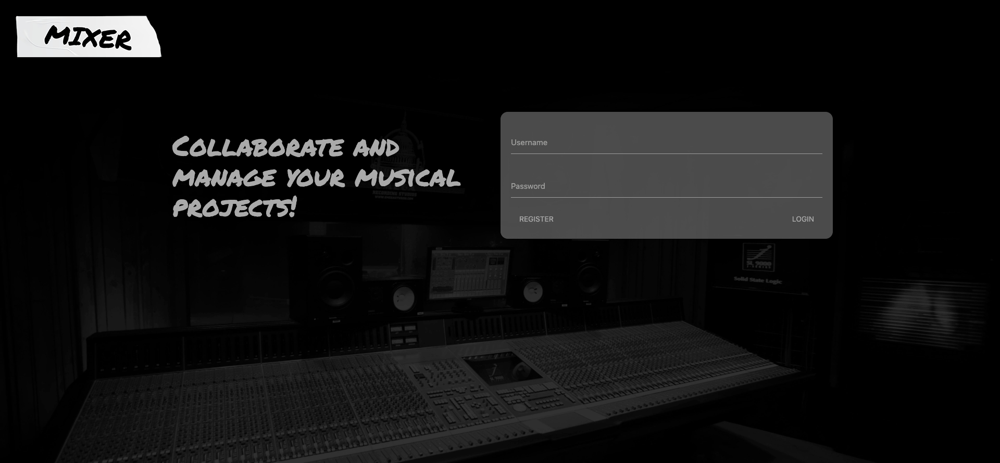

# Mixer

## Purpose
The purpose of Mixer is to give musicians a project management system to organize songs or clips into a specific project.

## Features
- Create an account or log in, then  view your projects and/or create a new one.
- When clicking on a project, you are redirected to a page that contains songs associated with the project.
- Create songs with title, description, and mp3.
- Delete songs within a project and whole projects.

## Screenshot

## Technologies Used
- Materialize
- jQuery
- Handlebars
- Amazon S3
- NPM Packages
  - MySQL2
  - Sequelize
  - Router
  - AWS-SDK
  - Dotenv
  - Bcrypt
  - Express
  - Express-Session
  - Express-FileUpload

## Links
[GitHub Repo](https://github.com/redteam5/mixer) 
[Heroku Deployed Application](https://afternoon-reef-59917.herokuapp.com/) 
[Presentation](https://docs.google.com/presentation/d/1A1GEGIWSzgUg6kWlSGoRb5EvqfTeYfRhDa5yrOKTJ44/edit?usp=sharing)
